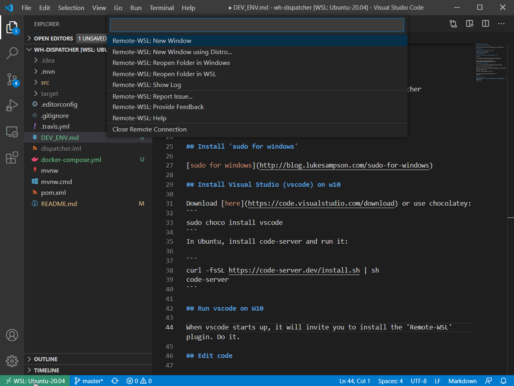

# WSL2 based dev environment

## Install WSL2

https://docs.microsoft.com/en-us/windows/wsl/install-win10

Tips:
* [Fluent Terminal](https://github.com/felixse/FluentTerminal)
* https://www.hanselman.com/blog/the-easy-way-how-to-ssh-into-bash-and-wsl2-on-windows-10-from-an-external-machine

## Get access to GitHub repo

Generate SSH key and upload it to github
Needed when accessing private repo's.

* [Generating new ssh-key](https://docs.github.com/en/github-ae@latest/github/authenticating-to-github/generating-a-new-ssh-key-and-adding-it-to-the-ssh-agent)
* [Adding new SSH key to GitHub account](https://docs.github.com/en/github-ae@latest/github/authenticating-to-github/adding-a-new-ssh-key-to-your-github-account)

## Install Docker Desktop

Install [Docker Desktop for Windows](https://www.docker.com/products/docker-desktop).

Right-click on the Docker task bar item, select Settings / Preferences and update Resources > File Sharing with any locations your source code is kept.

Enable the Windows WSL 2 back-end: Right-click on the Docker taskbar item and select Settings. Check Use the WSL 2 based engine and verify your distribution is enabled under Resources > WSL Integration.

## Optional: access Ubuntu filesystem Ubuntu in W10

In W10 :
```
cd \\wsl$\Ubuntu-20.04\home\bonami\IdeaProjects\wh-dispatcher
```

So you could use IntelliJ to edit the code. 
But the problem is using Windows Docker for WSL2.

## Install 'sudo for windows'

[sudo for windows](http://blog.lukesampson.com/sudo-for-windows)

## Install Visual Studio (vscode) on w10

Download [here](https://code.visualstudio.com/download) or use chocolatey:
```
sudo choco install vscode
```
Run it.


## Install Remote Development Extension pack

> Note: check [vscode documentation on remote development](https://code.visualstudio.com/docs/remote) to get the full story

Install the [Remote Development extension pack](https://aka.ms/vscode-remote/download/extension). This will allow you to develop on code located on a 'remote' machine, whether it be the Ubuntu on the WSL2 subsystem, or a dev container running in Docker -- see next 2 options.

## Option 1: develop on Ubuntu machine

> Note: not my preferred option

This option let's you use the Ubuntu host as the main development platform and run-time for your tests etc.

### Clone github repo on Ubuntu filesystem

### Install vscode-server on Ubuntu

In Ubuntu, install code-server and run it:

```
curl -fsSL https://code-server.dev/install.sh | sh
code-server
```
Long story [here](https://github.com/cdr/code-server).

### Edit code on Ubuntu's filesystem

Run vscode and click the green '><' button in the bottom-left corner of the IDE.



Select 'Remote-WSL: New window using distro...' from the dropbox, and pick the Ubuntu-20.04 distro.
Open folder and browse to the folder (on the Ubuntu fs) that contains the code.
Start coding :)

> Note: when you open a terminal in vscode, it will be a Ubuntu-bash terminal. Here you can run maven etc, and whatever you install in Ubuntu. The Ubuntu subsystem has become your full-time dev environment.

## Option 2: use a dev container

> Note: option 2 is preferred as it standardizes the IDE for all developers and is 100% discardable i.e. doesn't 'pollute' the Ubuntu subsystem

Supported container types:

* x86_64 / ARMv7l (AArch32) / ARMv8l (AArch64) Debian 9+, Ubuntu 16.04+, CentOS / RHEL 7+
* x86_64 Alpine Linux 3.9+

Other `glibc` based Linux containers may work if they have [needed Linux prerequisites](https://code.visualstudio.com/docs/remote/linux).

At this point you should already have all needed vscode plugins etc installed. If not, check [these instructions](https://code.visualstudio.com/docs/remote/containers-tutorial).

There's just too much to tell, so have a look at the [complete guide](https://code.visualstudio.com/docs/remote/containers#_quick-start-try-a-development-container)

In short:
* clone this github repo (the one you're looking at) on your local W10 host
* open the cloned folder in vscode
* click '<>' (bottom-left corner of vscode) and pick 'WSL-Remote Container: reopen in container'
* wait for the dev container to build

The  and [Dockerfile](./.devcontainer/Dockerfile) is where the magic happens.

Open a Terminal in vscode:

```
vscode ➜ /workspaces/wh-dispatcher (master ✗) $ mvn --version
Apache Maven 3.6.3 (cecedd343002696d0abb50b32b541b8a6ba2883f)
Maven home: /usr/local/sdkman/candidates/maven/current
Java version: 11.0.9.1, vendor: Oracle Corporation, runtime: /usr/local/openjdk-11
Default locale: en, platform encoding: UTF-8
OS name: "linux", version: "4.19.128-microsoft-standard", arch: "amd64", family: "unix"
```

You're developing in a dev container with all tools (mvn etc) pre-installed. Same tools and versions for all developers = standardization of the dev environment.

Finally, run the webapp:

```
vscode ➜ /workspaces/wh-dispatcher (master ✗) $ mvn spring-boot:run
```

Point your browser to [http://localhost:8080/](http://localhost:8080/). The HAL Explorer will load where you can inspect and call the REST api.

> Note: spring devtools is also started, so there will be 2 ports forwarded to your local host (8080, x) where x is a random port like 35729.

## Other vscode plugins

* [vscode-lombok plugin](https://marketplace.visualstudio.com/items?itemName=GabrielBB.vscode-lombok)
* [vscode-spring-boot plugin](https://marketplace.visualstudio.com/items?itemName=Pivotal.vscode-spring-boot)