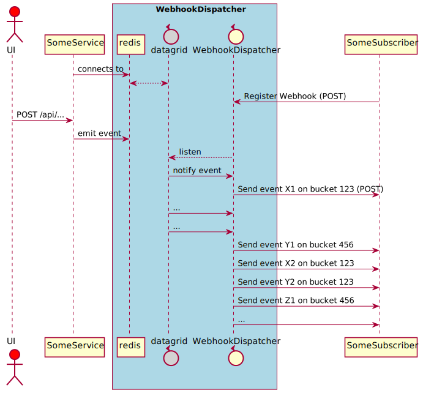

# Webhook Dispatcher

Spring Boot application that 
- offers an HTTP-API to event-subscribers which they can use to register a webhook (i.e. an endpoint URL in the subscriber's own api)
- POSTs event-payloads to these hooks as events occur at publisher's end

Events are published on redis, where they are picked up by the dispatcher, which pushes them to the hooks.

<!--

```
@startuml webhookArchitecture
Alice -> Bob: Hello
Bob -> Alice: Hi!
		
@enduml
```

-->




## Build app and push image

Username and password for the docker hub registry need to be passed. If you want to change the registry/repository, you can alter 

```bash
mvn package -Djib.to.auth.username=cbonami -Djib.to.auth.password=<password docker registry> -f ./wh-dispatcher/pom.xml
```

## Run app

```bash
mvn spring-boot:run -f ./wh-dispatcher/pom.xml
```

By default all dependencies (redis, admin-server, etc) are looked for on 'localhost'. You can use a couple of env variables to change this.
For example, this script will start the application when it's running inside docker-compose (as is the case with the workbench setup that uses vscode remote development):

```bash
# file: start-dispatcher-vscode.sh
export ADMIN_SERVER_HOST=admin-server
export REDIS_SERVER_HOST=redis
```

> Note: LiveReload server is also started for fast development (spring-dev-tools).

Following endpoints are exposed by the application:

```bash
# HAL Explorer; use this to TRAVERSE the api
gp preview $(gp url 8080)/browser/browser.html 

# Swagger Docs UI
gp preview $(gp url 8080)/swagger-ui.html

# Open API Spec yml file
gp preview $(gp url 8080)/v3/api-docs/

# Actuator API to inspect and manage the webservice
gp preview $(gp url 8080)/actuator
```

* [./clear-redis.sh](./clear-redis.sh) can be used to empty the redis database during testing.
* [./create-webhook.sh](./create-webhook.sh) creates a webhook that points to endpoint expose by wh-subscriber-dummy service

## Use app

Perform some HTTP-request via curl, postman, etc. Lazy people simply use the included [HAL Explorer](https://github.com/toedter/hal-explorer) or the Swagger Docs UI. 

```bash
# create webhook
curl -X POST $(gp url 8080)/api/webhooks -H  "accept: application/hal+json" -H  "Content-Type: application/json" -d "{\"url\":\"$(gp url 8081)/postit\",\"name\":\"someWebhook\",\"pubSub\":false}"

# emulate arriving message
curl -X POST $(gp url 8080)/api/webhooks/someWebhook/messages?bucketId=none -H  "accept: application/hal+json" -H  "Content-Type: application/json" -d "{\"type\":\"SomethingHappenedEvent\",\"data\":\"what the hell happened ?\"}"
```

## Load test

Make sure the wh-dispatcher app runs. Then:

```bash
mvn gatling:test -Dsimulation=LoadTest -Dduration=3600 -f ./wh-dispatcher/pom.xml
```

# redis

Redis is pre-installed ànd started as a daemon when the workbench starts. Internally, it runs on port 6379. It's also exposed to the outside world.

`redis-cli` is also pre-installed and ready to use.

# Dummy subscribing webhook application

A 'dummy' application exposing an endpoint that we can POST to, is automatically made available on port 8081 in the development workbench.

```bash
gp preview $(gp url 8081) 
```
# Administer 

A [Spring Boot Admin UI](https://github.com/codecentric/spring-boot-admin) is made available on port 8090 in the development workbench.

```bash
gp preview $(gp url 8090) 
```

You can also use the admin server to inspects logs (or change log levels) of both the dispatcher and the dummy subscriber service.

# Monitor

Grafana is pre-installed in the workbench. You can start it as follows:

```bash
sudo ./grafana/start-grafana.sh
gp preview $(gp url 3000) 
```

Configure the prometheus here:

```bash
sudo ./grafana/start-grafana.sh
gp preview $(gp url 3000)/datasources 
```

Prometheus is also pre-installed ànd started when the workbench starts. Normally there is no need to go to its dashboard, as almost everything can be done via Grafana. Neverthless:

```bash
gp preview $(gp url 9090)
```

Grafana offers a rich set of predefined dashboards. We're going to import the JVM dashboard :

```bash
gp preview $(gp url 3000)/dashboard/import
```

Then either upload the configuration saved as a JSON file or paste the dashboard url (https://grafana.com/grafana/dashboards/4701).

> Note: /var/log/grafana/grafana.log can be a useful source of information

# plantuml

```bash
java -jar plantuml.jar -Djava.awt.headless=true -tsvg README.md
```

This generates an svg file which needs to be committed and pushed to GitHub. More info [here](https://gist.github.com/noamtamim/f11982b28602bd7e604c233fbe9d910f).

# Setup vscode Dev Container

> Deprecated -- we are using Gitpod now

> Relies on Visual Studio Code (vscode)  

Development environment is 100% pre-cooked and standard for all developers. Docker-compose is used to spin up dependencies like redis etc. The development env/container is part of the docker-compose definition, and shares the same container network with the other containers (redis etc). Ports that are opened (by the webapp) are automatically forwarded to the host machine (probably W10).

See [WSL2_DEV_ENV.md](./WSL2_DEV_ENV.md) for instructions.

# Useful commands

```bash
# empty redis db
redis-cli -h localhost --raw keys "*:*:*" | xargs redis-cli -h localhost del
redis-cli -h localhost keys "*" | xargs -L1 -I '$' echo '"$"' | xargs redis-cli -h localhost del

# list all keys
redis-cli -h localhost keys "*"
```


